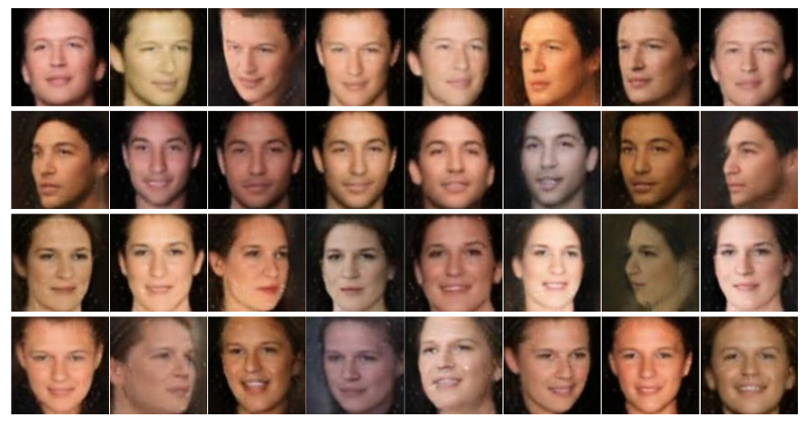
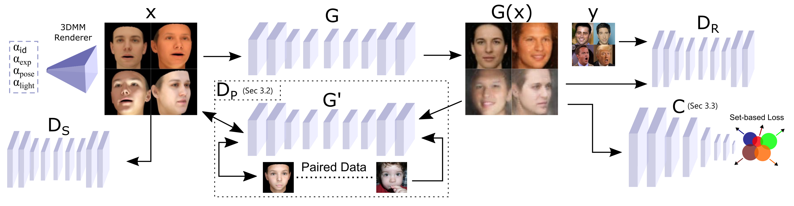
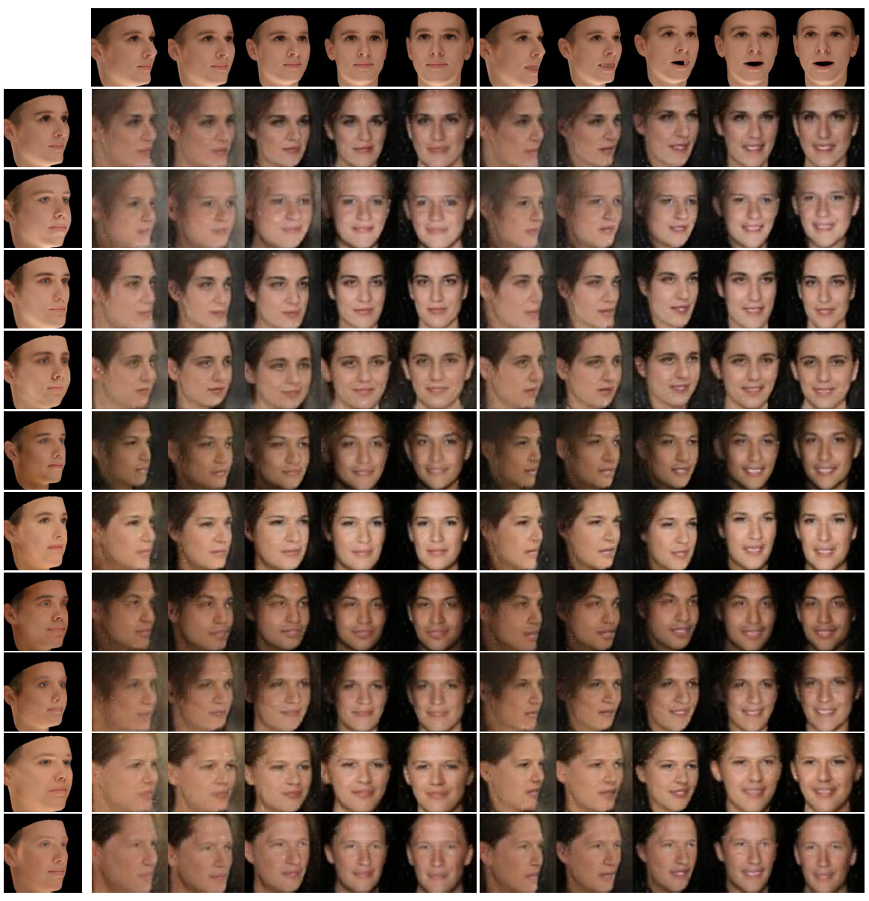

# [Semi-supervised Adversarial Learning to Generate Photorealistic Face Images of New Identities from 3D Morphable Model](https://arxiv.org/abs/1804.03675)

 [Baris Gecer](http://barisgecer.github.io)<sup> 1</sup>, [Binod Bhattarai](https://sites.google.com/view/bbinod)<sup> 1</sup>, [Josef Kittler](https://www.surrey.ac.uk/people/josef-kittler)<sup> 2</sup>, & [Tae-Kyun Kim](https://www.imperial.ac.uk/people/tk.kim)<sup> 1</sup>
 <br/>
 <sup>1 </sup>Department of Electrical and Electronic Engineering, Imperial College London, UK
 <br/>
 <sup>2 </sup>Centre for Vision, Speech and Signal Processing, University of Surrey, UK

This repository provides a Tensorflow implementation of our study where we propose a novel end-to-end semi-supervised adversarial framework to generate photorealistic face images of new identities with wide ranges of expressions, poses, and illuminations conditioned by a 3D morphable model.

<br/>

<p align="center"></p>

<br/>

## Approach

<p align="center"></p>
Our approach aims to synthesize photorealistic images conditioned by a given synthetic image by 3DMM. It regularizes cycle consistency by introducing an additional adversarial game between the two generator networks in an unsupervised fashion. Thus the under-constraint cycle loss is supervised to have correct matching between the two domains by the help of a limited number of paired data. We also encourage the generator to preserve face identity by a set-based supervision through a pretrained classification network.


(This documentation is still under construction, please refer to our paper for more details)
<br/>
## Dependencies
* [TensorFlow 1.2](https://www.tensorflow.org/)
* [Python 3.5](https://www.continuum.io/downloads)

## Data

* Generate synthetic images using any 3DMM model i.e. [LSFM](https://xip.uclb.com/i/healthcare_tools/LSFM.html) or [Basel Face Model](https://faces.cs.unibas.ch/bfm/) by running gen_syn_latent.m
* Align and crop all datasets using MTCNN to 108x108

## Usage

Train by the following script

```bash
$ python main.py    --log_dir [path2_logdir] --data_dir [path2_datadir] --syn_dataset [synthetic_dataset_name]
                    --dataset [real_dataset_name] --dataset_3dmm [300W-3D & AFLW2000_dirname] --input_scale_size 108
```
Add --load_path [paused_training_logdir] to continue a training

Generate realistic images after training by the following script
```bash
$ python main.py    --log_dir [path2_logdir] --data_dir [path2_datadir] --syn_dataset [synthetic_dataset_name]
                    --dataset [real_dataset_name] --dataset_3dmm [300W-3D & AFLW2000_dirname] --input_scale_size 108
                    --save_syn_dataset [saving_dir] --train_generator False --generate_dataset True --pretrained_gen [path2_logdir + /model.ckpt]
```

## More Results

<p align="center"></p>

<br/>

## Citation
this work is useful for your research, please cite our [paper](https://arxiv.org/pdf/1804.03675.pdf):

```
@article{gecer2018semisup,
  title={Semi-supervised Adversarial Learning to Generate Photorealistic Face Images of New Identities from 3D Morphable Model},
  author={Gecer, Baris and Bhattarai, Binod and Kittler, Josef and Kim, Tae-Kyun},
  journal={arXiv preprint arXiv:1804.03675},
  year={2018}
}

```

<br/>

## Acknowledgement
This work was supported by the EPSRC Programme Grant ‘FACER2VM’ (EP/N007743/1). Baris Gecer is funded by the Turkish Ministry of National Education. This study is morally motivated to improve face recognition to help prediction of genetic disorders visible on human face in earlier stages.

Code borrows heavily from [carpedm20 BEGAN implementation](https://github.com/carpedm20/began-tensorflow).
